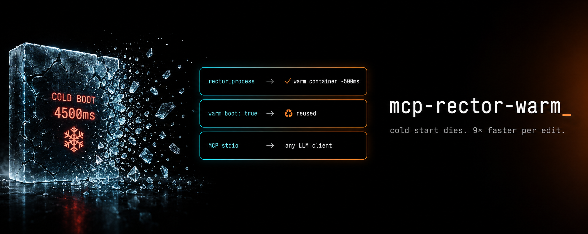

<p align="center">
  
</p>

# mcp-rector-warm

> **Stop paying [Rector](https://getrector.com/)'s cold-start tax on every edit.**
> A warm-process [MCP](https://modelcontextprotocol.io/) server that keeps the [Rector](https://github.com/rectorphp/rector) container hot. ~9× faster per call. Works with every MCP client.

[](https://github.com/Digital-Process-Tools/mcp-rector-warm/actions/workflows/tests.yml)
[](https://packagist.org/packages/dpt/mcp-rector-warm)
[](https://www.php.net/)
[](LICENSE)

[Why](#why) • [Install](#install) • [Use it](#use-it) • [Benchmark](#benchmark) • [Compatibility](#compatibility) • [How it works](#how-it-works) • [FAQ](#faq)

---

## Why

[Rector](https://getrector.com/) is one of the most useful tools in modern PHP — automated refactoring, type fixes, version upgrades. It is also one of the slowest to **start**.

Every `rector process foo.php` pays the same toll: autoloader bootstrap, [DI container](https://github.com/rectorphp/rector/blob/main/src/DependencyInjection) build, ruleset compile. **~3-5 seconds before a single rule fires.** For agents and validators that run Rector after every edit, that cold-start cost dominates wall time.

`mcp-rector-warm` keeps a warm Rector container ready across calls. **First call pays the boot once. Every subsequent call reuses it** -- the container itself always lives in a forked worker, never in the long-lived daemon process (#31), so re-editing `rector.php` between calls can never crash the server.

## Install

```bash
composer global require dpt/mcp-rector-warm
```

Makes `mcp-rector-warm` available on `$PATH`.

Requires PHP 8.2+. Pulls Rector ^2.4 as a real Composer dep (no phar gymnastics).

## Use it

### Claude Desktop

Edit `~/Library/Application Support/Claude/claude_desktop_config.json` (macOS) or `%APPDATA%\Claude\claude_desktop_config.json` (Windows):

```json
{
  "mcpServers": {
    "rector": {
      "command": "mcp-rector-warm",
      "args": [
        "--working-dir=/path/to/your/project",
        "--config=/path/to/your/project/rector.php"
      ]
    }
  }
}
```

Restart Claude. Ask: *"Run Rector on src/Foo.php"*.

### VS Code (Copilot chat / agent mode)

VS Code 1.102+ runs MCP servers natively. Add `.vscode/mcp.json` to the project:

```json
{
  "servers": {
    "rector": {
      "type": "stdio",
      "command": "${workspaceFolder}/vendor/bin/mcp-rector-warm",
      "args": [
        "--working-dir=${workspaceFolder}",
        "--config=${workspaceFolder}/rector.php"
      ]
    }
  }
}
```

With `composer global require`, use `"command": "mcp-rector-warm"` instead. If Composer's `vendor-dir` is not `vendor/`, adjust the path.

This gives Rector to chat and agent mode. It does **not** run Rector on save or underline code in the editor. That needs a language server, tracked in [#51](https://github.com/Digital-Process-Tools/mcp-rector-warm/issues/51).

### Cline / Continue / Cursor / Zed / any MCP client

Same `command` + `args` shape. The server speaks plain MCP over stdio — no client-specific glue.

### Standalone

```bash
mcp-rector-warm --working-dir=/path/to/project --config=/path/to/project/rector.php
```

Reads MCP JSON-RPC on stdin, writes responses on stdout.

## Options

| Flag | Default | Meaning |
|------|---------|---------|
| `--working-dir=PATH` | current directory | `chdir()`s here before anything else runs; `rector_process` refuses any path outside it. |
| `--config=PATH` | Rector's own resolution (`rector.php`/`rector.dist.php` in `--working-dir`) | Passed straight through to Rector; not parsed by mcp-rector-warm itself. |
| `--call-timeout=SECONDS` | `600` | Hard per-call deadline, independent of PHP's `default_socket_timeout` ([#32](https://github.com/Digital-Process-Tools/mcp-rector-warm/issues/32)), for a `dryRun: true` (analysis-only) call: a call still working past `default_socket_timeout` keeps going, but one that outruns `--call-timeout` is killed and reported as an error instead of blocking the caller forever ([#58](https://github.com/Digital-Process-Tools/mcp-rector-warm/issues/58)). `0` disables it. Measured on a real project: 0.3-2.4s per warm call, ~10s for the first (container-building) call — 600s never cuts off real work. **This deadline never applies to a `dryRun: false` (write) call** ([#72](https://github.com/Digital-Process-Tools/mcp-rector-warm/issues/72)): the kill is an unconditional SIGKILL with no grace for an in-flight file write, and Rector writes each changed file by truncating it and then writing the new content, so a kill landing mid-write would leave that file truncated with no backup. Rather than risk that, a write call is simply never bound by `--call-timeout` at all — trade-off: a genuinely wedged write call can now hang indefinitely, in exchange for never truncating a file it is writing. This is a real change from v0.5.0, not a return to "the pre-#58 status quo": before #58 introduced any deadline, a wedged write still timed out the socket read after PHP's `default_socket_timeout` (~60s) and the daemon reported it as a closed connection while continuing to serve other calls. At this release a wedged write blocks the single-threaded warm daemon indefinitely -- every later call from any client hangs too, not just the wedged one, until the daemon is restarted. |

## Benchmark

Measured with `tools/warm-vs-cold.py` on a real private production codebase (PHP 8.2.0, Apple Silicon, v0.5.0 at `4902c3d`): 20 files sampled across the tree, each run once through one warm server session and once through a fresh `rector process --dry-run`, cold runs serial so neither side shares CPU with the other.

| Setup | median | p95 | Notes |
|-------|--------|-----|-------|
| Cold `rector process`, one file | 7.02s | 9.00s | autoloader + container + ruleset each time |
| **mcp-rector-warm, later calls** | **0.68s** | **2.40s** | container reused |
| mcp-rector-warm, start + handshake | 0.1s | | the container is not built yet |
| mcp-rector-warm, first call | 6.4s | | builds the container: costs about one cold run, paid **once** per session |

**~10× faster per call at the median.** 20 files: **144s cold → 30s warm**, first call included. All 20 warm answers matched the cold ones.

The start and first-call rows come from a separate probe: 3 fresh sessions, each starting with the same small file, which takes 5.9-7.3s cold. The first call took 6.37-6.42s each time, and a second, different file then took 0.28-0.31s. The server builds the container on the first call, not at start, so an idle server costs nothing. The first call costs about the same as running Rector once without the server.

Numbers vary with project size and rule set. The win is the cold-start amortization, not magic. Reproduce on your own project:

```bash
python3 tools/warm-vs-cold.py --project /path/to/project --files 'src/**/*.php' --limit 20 --jobs 1 --out /tmp/wvc
```

The script needs the Python MCP client from `tests/E2E/requirements.txt`, and writes the timings to `report.md` in `--out`.

## Compatibility

| Client | Status |
|--------|--------|
| Claude Desktop | ✅ stdio MCP |
| VS Code (Copilot chat / agent mode) | ✅ stdio MCP, `.vscode/mcp.json` |
| Cline (VS Code) | ✅ stdio MCP |
| Continue (VS Code / JetBrains) | ✅ stdio MCP |
| Cursor | ✅ stdio MCP |
| Zed | ✅ stdio MCP |
| Custom (Python/Node/Go MCP clients) | ✅ standard protocol |

Any client that speaks MCP stdio works. No custom protocol.

## Tools exposed

### `rector_process`

Run Rector on a path.

| Argument | Type | Default | Description |
|----------|------|---------|-------------|
| `path` | string | required | Absolute path to file or directory under the working dir |
| `dryRun` | bool | `true` | Preview changes only. `false` writes them. `--call-timeout` never applies to a `dryRun: false` call ([#72](https://github.com/Digital-Process-Tools/mcp-rector-warm/issues/72)) — see the `--call-timeout` row above for the trade-off. |

Returns:

```json
{
  "exit_code": 0,
  "output": "...",
  "warm_boot": true
}
```

`warm_boot: true` ⇒ container reused. `false` ⇒ first call (cold boot just finished).

**Failure is reported as an MCP tool error.** A rejected path (outside the
working dir), a nonexistent path, a project with no `rector.php` and no
`--config` given at startup, or an exception raised inside Rector itself all
come back as a tool result with `isError: true`, so an MCP host can see the
failure and surface it instead of treating a broken call as a success. The
structured details survive in `structuredContent`:

```json
{
  "exit_code": -1,
  "output": "",
  "warm_boot": false,
  "error": "rector_process: path is outside the configured working directory.",
  "error_class": "SecurityError",
  "trace": ""
}
```

A missing config reports `error_class: "RuntimeException"` with a message naming
`--config` and `rector.php`. The daemon does not restart itself: add a
`rector.php` and call again, and it boots normally, since a failed boot never
marks the container warm.

The tool also declares its behavior via MCP tool annotations: `readOnlyHint:
false` (a non-dry-run call writes files), `destructiveHint: true`,
`idempotentHint: false`, `openWorldHint: false`.

## Language server

`bin/rector-warm-lsp` (#53) is a second entry point on the same warm core as
the MCP server, speaking [LSP](https://microsoft.github.io/language-server-protocol/)
over stdio instead of MCP -- for editors that want Rector diagnostics on save
rather than an agent calling a tool. Same `--working-dir` flag as
`bin/mcp-rector-warm`; `--config` works the same passive way (left in
`$_SERVER['argv']` for `RectorConfigsResolver` to pick up).

On `didOpen`/`didSave` it runs `rector_process` with `dryRun: true` on that
file and publishes one diagnostic per changed hunk (severity Information,
`source: "rector"`, message = the rule name(s) that hunk came from).
`textDocument/codeAction` over a diagnostic offers `Apply Rector: <rule>` --
a `WorkspaceEdit` built straight from Rector's own unified diff, no full-file
read needed -- plus a whole-file "Apply all Rector fixes" action. `didClose`
clears a file's diagnostics. Results are pinned to the document version that
requested them, so a stale one is discarded if a newer `didSave` for the same
document finishes first -- inert in the current strictly-synchronous stdio
loop (nothing can race it there today), kept as defense-in-depth for a future
async/pipelined transport.

Out of v1 scope: unsaved buffers (Rector reads from disk), workspace-wide
scans, and `workspace/configuration`.

### Editor setup

Every editor below spawns the same command:
`rector-warm-lsp --working-dir=/path/to/project` (composer-global install) or
`vendor/bin/rector-warm-lsp --working-dir=/path/to/project` (local clone),
filetype `php`, root markers `composer.json` / `rector.php`.

**These snippets are written against each editor's own published LSP-client
documentation. None of them has been run against a live install of Neovim,
Zed, Helix, Sublime Text or PhpStorm/LSP4IJ in the environment that produced
this change** -- treat each as a documented starting point, not a verified
recipe, until someone runs it against a real editor and records the version
it was tested against.

#### Neovim (0.11+, native `vim.lsp.config`)

```lua
-- ~/.config/nvim/lsp/rector.lua
-- `cmd` is a function, not a static list: `--working-dir` has to be the
-- resolved project root (matched against root_markers below), not whatever
-- directory Neovim happened to start in -- `vim.fn.getcwd()` would silently
-- point rector-warm-lsp at the wrong project whenever Neovim isn't launched
-- from the exact project root, or in a multi-root session.
return {
  cmd = function(dispatchers, config)
    local root = config.root_dir or vim.fn.getcwd()
    return vim.lsp.rpc.start('rector-warm-lsp', { '--working-dir=' .. root }, dispatchers)
  end,
  filetypes = { 'php' },
  root_markers = { 'composer.json', 'rector.php' },
}
```

```lua
-- init.lua
vim.lsp.enable('rector')
```

On older Neovim via [nvim-lspconfig](https://github.com/neovim/nvim-lspconfig), register a custom server before calling `setup`, using `on_new_config` so `cmd` picks up each resolved root rather than a fixed `vim.fn.getcwd()`:

```lua
local lspconfig = require('lspconfig')
local configs = require('lspconfig.configs')
if not configs.rector_warm then
  configs.rector_warm = {
    default_config = {
      cmd = { 'rector-warm-lsp' },
      filetypes = { 'php' },
      root_dir = lspconfig.util.root_pattern('composer.json', 'rector.php'),
    },
    on_new_config = function(new_config, new_root_dir)
      new_config.cmd = { 'rector-warm-lsp', '--working-dir=' .. new_root_dir }
    end,
  }
end
lspconfig.rector_warm.setup({})
```

#### Zed

Zed's stable path for an arbitrary, non-bundled LSP is a small
[language server extension](https://zed.dev/docs/extensions/languages#language-servers)
rather than a plain `settings.json` entry -- unlike Neovim/Helix/Sublime, there
is no documented `settings.json` shape here yet to snippet honestly. Filed as
a gap for a follow-up rather than guessed at.

#### Helix

```toml
# ~/.config/helix/languages.toml
[language-server.rector-warm-lsp]
command = "rector-warm-lsp"
args = ["--working-dir=."]

[[language]]
name = "php"
language-servers = ["rector-warm-lsp"]
```

Helix spawns language servers with the workspace root as the working
directory already, so `--working-dir=.` resolves correctly.

#### Sublime Text ([LSP package](https://github.com/sublimelsp/LSP))

```json
// LSP.sublime-settings
{
  "clients": {
    "rector-warm-lsp": {
      "enabled": true,
      "command": ["rector-warm-lsp", "--working-dir=${folder}"],
      "selector": "source.php"
    }
  }
}
```

#### PhpStorm / IntelliJ ([LSP4IJ](https://github.com/redhat-developer/lsp4ij) plugin)

LSP4IJ has no project-file snippet for an ad hoc server; it is wired through
its UI: **Settings > Languages & Frameworks > Language Servers > +**, define
a server with command `rector-warm-lsp --working-dir=$ProjectFileDir$` and
file name pattern `*.php`.

## How it works

Three decisions worth knowing:

1. **One daemon per project, not per call -- but the container it holds always lives in a forked worker, never in the daemon itself.** Working dir pins at server startup, keeping `$_SERVER['argv']` clean for `RectorConfigsResolver`. Before every call the runner hashes the resolved `rector.php`/`rector.dist.php` (whichever `RectorConfigsResolver` would pick), every file the config registered via `withBootstrapFiles()`, AND the project's `composer.json` (`withPhpSets()` with no argument reads its `require.php` once at boot to pick its rule sets), and a changed hash on any of them tears the current worker down and forks a brand-new one, so an edit to the config, to a bootstrap file it requires, or to `composer.json`'s PHP constraint takes effect on the next call rather than waiting for a restart. Booting always happens in a process that has never booted before: `rector.php` is a plain PHP file `require`d while building the container, and re-`require`ing it in a process that already required it once is a PHP fatal ("Cannot declare class/function already declared") when the config declares a class or function -- so the daemon process itself never boots the container; it only ever talks to a worker over a socket. Only the main config file, its declared bootstrap files and `composer.json` are hashed; a `rector.php` that `require`s some OTHER shared file directly (not via `withBootstrapFiles()`) is a known limitation -- touch/edit the main config file too to force a reboot after changing what it includes. `composer.json` is watched wholesale, not just its `require.php`: a project whose config never calls bare `withPhpSets()` still reboots on an unrelated `composer.json` edit (a new dependency, a reformat), the same coarse trade-off already accepted for the main config file. The target project's own `vendor/autoload.php` (if present) is loaded once per worker, the same way cold Rector's own CLI loads it for a composer-global install, so a class that only resolves through the project's Composer autoloader is visible to warm calls too; a `composer dump-autoload` mid-session is not picked up until the worker's next reboot.

2. **Parallel mode forcibly disabled (`--debug` flag).** Rector's worker fork model expects `$_SERVER['argv'][0]` to be the rector CLI binary. From an MCP server it isn't, so workers can't respawn. Single-thread analysis only — that's fine for the per-file edit loop this is designed for.

3. **Runtime-prefixed namespace handled.** Rector's bundled Symfony is namespaced `RectorPrefix<date>\\Symfony\\Component\\Console\\...` to avoid dependency conflicts. The runner detects the prefix at boot and resolves Application/Input/Output class names dynamically. Survives Rector version bumps.

4. **A missing config, a config with zero rules, or a project's own `rector.php` printing while it loads, cannot corrupt the MCP stdout.** Rector's CLI treats a missing `rector.php`, or one that loads fine but registers no rules or sets, as friendly onboarding, and Symfony's console output writes straight to the real stdout stream, bypassing an `ob_start()` wrap entirely -- and a project's `rector.php` can `echo`, or trigger a notice/deprecation, while it loads. None of that reaches the JSON-RPC pipe: both a missing config and a config with zero registered rules are refused as a real, reported error *before* any of Rector's own console machinery runs (per call, not at server startup -- a `rector.php` fixed up later just works on the next call), config resolution and container boot run inside an output buffer, and PHP's own error display is pointed at stderr (`display_errors=stderr`).

## FAQ

**Does this replace `vendor/bin/rector`?** No. Use it from MCP clients (Claude Desktop, agents). For one-off CLI calls the regular binary is still simpler.

**Can it apply changes?** Yes — pass `dryRun: false`. (Rector itself has no `--fix` flag: it writes by default and only previews with `--dry-run`.) This always works, regardless of `--call-timeout` ([#72](https://github.com/Digital-Process-Tools/mcp-rector-warm/issues/72)): the deadline only ever bounds a `dryRun: true` call. A write call is never killed by it — see the `--call-timeout` row's trade-off.

**Why not a phar?** Rector ships as a real Composer library. Phar packaging would just add a runtime cost without a benefit here.

**Memory?** The daemon sets `memory_limit = -1` like Rector's own CLI. Idle daemon ≈ 80MB resident.

**Does it survive Rector version updates?** Probably. The prefix-detection scheme is forward-compatible with new `RectorPrefix<date>` values. Pin a Rector version in your own `composer.json` if you need determinism.

## Credits

- **[Rector](https://github.com/rectorphp/rector)** by [Tomas Votruba](https://github.com/TomasVotruba) and contributors — the engine doing all the real work. If you ship PHP, [sponsor him](https://github.com/sponsors/TomasVotruba).
- **[Model Context Protocol](https://modelcontextprotocol.io/)** by Anthropic — the protocol that makes this kind of tool integration possible.
- **[mcp/sdk](https://github.com/modelcontextprotocol/php-sdk)** — official PHP SDK, used here for stdio transport + tool discovery.

## Related

- **[Rector docs](https://getrector.com/documentation)** — config, rules, sets.
- **[Rector on Packagist](https://packagist.org/packages/rector/rector)** — the upstream package.
- **[claude-supertool](https://github.com/Digital-Process-Tools/claude-supertool)** — DPT's batched-ops Claude Code companion; integrates this server as a validator.

## License

Community License — see [LICENSE](LICENSE). Built by [Digital Process Tools](https://github.com/Digital-Process-Tools).
